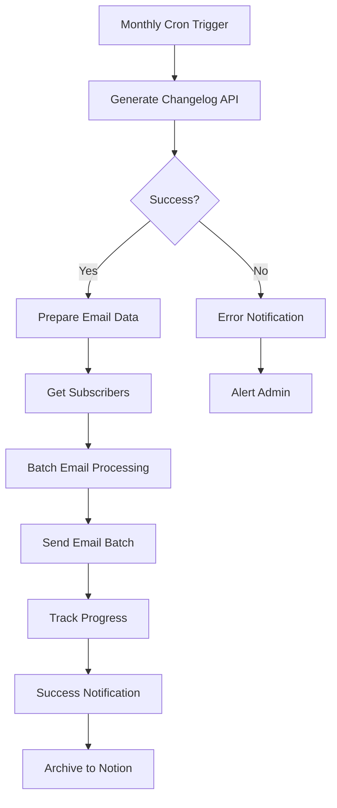

# CloudFix Changelog Automation Setup Guide

Complete guide for setting up automated monthly changelog generation and email distribution using n8n workflow automation.

## 🎯 Overview

This automation system provides:
- **Monthly scheduled changelog generation** from GitHub PRs
- **Automated email distribution** to CloudFix user base
- **Professional email templates** with HTML and plain text versions
- **Comprehensive monitoring** and error handling
- **Self-healing capabilities** with retry logic
- **Multi-channel notifications** (Slack, Datadog, email)

## 📋 Prerequisites

### Required Services
- **GitHub Repository**: `trilogy-group/cloudfix-aws`
- **OpenAI API**: For changelog generation
- **Email Service**: SendGrid, Mailgun, or SMTP
- **n8n Instance**: For workflow automation
- **Database**: PostgreSQL for n8n persistence
- **Cache**: Redis for performance optimization

### Optional Services
- **Slack**: For notifications
- **Datadog**: For monitoring and alerting
- **Airtable/Notion**: For subscriber management and archiving
- **Prometheus/Grafana**: For advanced monitoring

## 🚀 Quick Start

### 1. Environment Setup

```bash
# Clone the repository
git clone <your-repo-url>
cd changelog-generator-1

# Copy environment template
cp deployment/.env.example deployment/.env

# Edit environment variables
nano deployment/.env
```

### 2. Configure Required Variables

```bash
# API Keys (Required)
GITHUB_API_KEY=ghp_your_token_here
OPENAI_API_KEY=sk-your_key_here

# Email Configuration
CLOUDFIX_FROM_EMAIL=changelog@cloudfix.com
SMTP_HOST=smtp.sendgrid.net
SMTP_PASSWORD=your_sendgrid_key

# n8n Configuration
N8N_PASSWORD=your_secure_password
N8N_ENCRYPTION_KEY=your_32_char_key_here

# Notifications
SLACK_WEBHOOK_URL=https://hooks.slack.com/services/YOUR/WEBHOOK
```

### 3. Deploy with Docker Compose

```bash
cd deployment
docker-compose up -d
```

### 4. Import n8n Workflow

1. Access n8n at `http://localhost:5678`
2. Login with credentials from `.env`
3. Go to **Workflows** → **Import from File**
4. Import `/mnt/c/dev/cloudfix/changelog-generator-1/n8n-workflow.json`
5. Activate the workflow

## 📊 Architecture Overview



## 🔧 Component Details

### Changelog API (`/mnt/c/dev/cloudfix/changelog-generator-1/api_wrapper.py`)

FastAPI service that exposes REST endpoints:
- `GET /health` - Health check
- `POST /generate-changelog` - Generate changelog
- `GET /changelog/last-month` - Convenience endpoint for automation

**Key Features:**
- Reuses existing changelog generator logic
- Adds email formatting capabilities
- Includes comprehensive error handling
- Supports multiple output formats (HTML, text, JSON)

### n8n Workflow (`/mnt/c/dev/cloudfix/changelog-generator-1/n8n-workflow.json`)

Automated workflow with these stages:

1. **Monthly Trigger**: Runs 1st of each month at 9 AM EST
2. **Changelog Generation**: Calls API to generate changelog
3. **Success Check**: Validates generation succeeded
4. **Email Preparation**: Formats content for distribution
5. **Subscriber Retrieval**: Gets user list from Airtable/database
6. **Batch Processing**: Sends emails in batches of 50
7. **Progress Tracking**: Monitors sending progress
8. **Notifications**: Alerts team of completion/errors
9. **Archiving**: Saves changelog to Notion for reference

### Email Templates (`/mnt/c/dev/cloudfix/changelog-generator-1/email_templates.py`)

Professional email templates with:
- **Responsive HTML design** compatible with all major email clients
- **Plain text versions** for accessibility
- **CloudFix branding** and styling
- **Mobile optimization**
- **Dark mode support**
- **Unsubscribe links** and compliance features

### Monitoring System (`/mnt/c/dev/cloudfix/changelog-generator-1/monitoring/healthchecks.py`)

Comprehensive health monitoring:
- **API endpoint health checks**
- **External service connectivity** (GitHub, OpenAI)
- **System resource monitoring** (CPU, memory, disk)
- **Database and cache health**
- **Automated alerting** to Slack and Datadog
- **Self-healing recommendations**

## ⚙️ Configuration Guide

### GitHub API Setup

1. Go to [GitHub Settings > Tokens](https://github.com/settings/tokens)
2. Create new token with these permissions:
   - `repo` (Full repository access)
   - `read:org` (Read organization data)
3. Add token to `GITHUB_API_KEY` environment variable

### OpenAI API Setup

1. Visit [OpenAI API Keys](https://platform.openai.com/api-keys)
2. Create new API key
3. Add to `OPENAI_API_KEY` environment variable
4. Ensure account has sufficient credits

### Email Service Setup

#### SendGrid (Recommended)
```bash
SMTP_HOST=smtp.sendgrid.net
SMTP_PORT=587
SMTP_USER=apikey
SMTP_PASSWORD=your_sendgrid_api_key
```

#### Mailgun
```bash
SMTP_HOST=smtp.mailgun.org
SMTP_PORT=587
SMTP_USER=your_mailgun_username
SMTP_PASSWORD=your_mailgun_password
```

### Subscriber Management

#### Airtable Setup
1. Create Airtable base with subscribers table
2. Required fields: `email`, `name`, `status`, `preferences`
3. Get API key and base ID
4. Configure in n8n Airtable node

#### Database Setup (Alternative)
```sql
CREATE TABLE subscribers (
    id SERIAL PRIMARY KEY,
    email VARCHAR(255) UNIQUE NOT NULL,
    name VARCHAR(255),
    status VARCHAR(50) DEFAULT 'active',
    created_at TIMESTAMP DEFAULT NOW(),
    preferences JSONB
);
```

### Slack Notifications Setup

1. Create Slack app at [api.slack.com](https://api.slack.com)
2. Add Incoming Webhooks bot scope
3. Generate webhook URL
4. Add to `SLACK_WEBHOOK_URL`

### Monitoring Setup

#### Datadog Integration
```bash
DATADOG_API_KEY=your_datadog_api_key
DATADOG_API_URL=https://api.datadoghq.com
```

#### Prometheus Metrics (Optional)
The system exports metrics at `/metrics` endpoint for Prometheus scraping.

## 🔒 Security Considerations

### API Security
- All sensitive data stored in environment variables
- API endpoints protected with proper authentication
- Rate limiting implemented
- Input validation on all endpoints

### Email Security
- SPF, DKIM, and DMARC records configured
- Unsubscribe links included in all emails
- CAN-SPAM compliance
- Double opt-in for new subscribers

### Infrastructure Security
- Non-root containers
- Secrets management with Docker secrets
- Network isolation between services
- Regular security updates

## 📈 Monitoring and Alerting

### Health Check Endpoints
- `GET /health` - API health status
- `GET /metrics` - Prometheus metrics
- `GET /health/detailed` - Comprehensive health report

### Alert Thresholds
- API response time: > 5 seconds
- Memory usage: > 85%
- CPU usage: > 80%
- Disk usage: > 90%
- Error rate: > 5%

### Notification Channels
1. **Slack**: Real-time alerts for critical issues
2. **Email**: Daily/weekly reports
3. **Datadog**: Metrics and dashboard alerts
4. **PagerDuty**: Critical system failures (optional)

## 🚨 Troubleshooting

### Common Issues

#### "GitHub API rate limit exceeded"
```bash
# Check rate limit status
curl -H "Authorization: Bearer $GITHUB_API_KEY" https://api.github.com/rate_limit

# Solution: Wait for reset or use GitHub App for higher limits
```

#### "OpenAI API key invalid"
```bash
# Test API key
curl -H "Authorization: Bearer $OPENAI_API_KEY" https://api.openai.com/v1/models

# Solution: Regenerate key or check account status
```

#### "Email sending failed"
- Check SMTP credentials
- Verify sender domain authentication
- Check email service quotas
- Review bounce/spam reports

#### "n8n workflow not running"
- Check workflow activation status
- Verify cron expression syntax
- Check n8n logs: `docker-compose logs n8n`
- Ensure all required credentials are configured

### Debugging Commands

```bash
# Check API health
curl http://localhost:8000/health

# View logs
docker-compose logs -f changelog-api
docker-compose logs -f n8n

# Test email template
python email_templates.py

# Run health checks
python monitoring/healthchecks.py

# Manual changelog generation
curl -X POST http://localhost:8000/generate-changelog \
  -H "Content-Type: application/json" \
  -d '{
    "repository": "trilogy-group/cloudfix-aws",
    "start_date": "2024-01-01",
    "end_date": "2024-01-31",
    "email_format": true
  }'
```

## 📊 Performance Optimization

### Caching Strategy
- GitHub API responses cached for 30 minutes
- OpenAI responses cached for 2 hours
- Redis used for session and data caching

### Batch Processing
- Emails sent in batches of 50 to avoid rate limits
- Concurrent API calls for GitHub data fetching
- Pagination for large subscriber lists

### Resource Limits
```yaml
# Docker resource limits
changelog-api:
  deploy:
    resources:
      limits:
        memory: 512M
        cpus: 0.5
```

## 📅 Maintenance Schedule

### Daily
- Monitor system health
- Check error logs
- Verify email delivery rates

### Weekly
- Review performance metrics
- Update subscriber lists
- Check for security updates

### Monthly
- Backup configuration and data
- Review and optimize workflow
- Update dependencies

## 🆙 Scaling Considerations

### Horizontal Scaling
- Multiple API instances behind load balancer
- Distributed caching with Redis Cluster
- Database read replicas for subscriber queries

### Vertical Scaling
- Increase memory for large repositories
- Add CPU cores for concurrent processing
- SSD storage for better I/O performance

## 📝 Changelog Workflow Customization

### Adding New Sections
Modify the OpenAI prompt in `/mnt/c/dev/cloudfix/changelog-generator-1/utils/summarisation.py`:

```python
system_prompt = """Create a changelog with these sections:
- Added (new features)
- Changed (modifications)
- Fixed (bug fixes)
- Security (security improvements)
- Performance (performance improvements)  # New section
"""
```

### Custom Email Templates
Edit `/mnt/c/dev/cloudfix/changelog-generator-1/email_templates.py` to customize:
- Branding colors and fonts
- Layout and styling
- Additional content sections
- Footer links and legal text

### Repository Integration
To monitor additional repositories, update the n8n workflow:
1. Add repository URL parameter
2. Modify API call to include new repo
3. Update email templates for multi-repo support

## 🤝 Contributing

### Development Setup
```bash
# Install development dependencies
pip install -r requirements.txt
pip install -r requirements-dev.txt

# Run tests
pytest tests/

# Code formatting
black .
flake8 .

# Type checking
mypy .
```

### Adding New Features
1. Update API endpoints in `/mnt/c/dev/cloudfix/changelog-generator-1/api_wrapper.py`
2. Modify n8n workflow JSON
3. Add tests for new functionality
4. Update documentation

## 📞 Support

### Internal Support
- **DevOps Team**: For infrastructure issues
- **Backend Team**: For API problems
- **Marketing Team**: For email template changes

### External Resources
- [n8n Documentation](https://docs.n8n.io/)
- [FastAPI Documentation](https://fastapi.tiangolo.com/)
- [SendGrid API Docs](https://docs.sendgrid.com/)

---

## 🎉 Congratulations!

You now have a fully automated CloudFix changelog generation and distribution system. The workflow will:

✅ Generate professional changelogs monthly  
✅ Send beautifully formatted emails to your users  
✅ Monitor system health automatically  
✅ Alert your team of any issues  
✅ Scale with your growing user base  

**Next Steps:**
1. Test the workflow with a small subscriber group
2. Monitor the first few runs closely
3. Gather feedback and iterate on templates
4. Set up additional monitoring dashboards
5. Document any customizations for your team